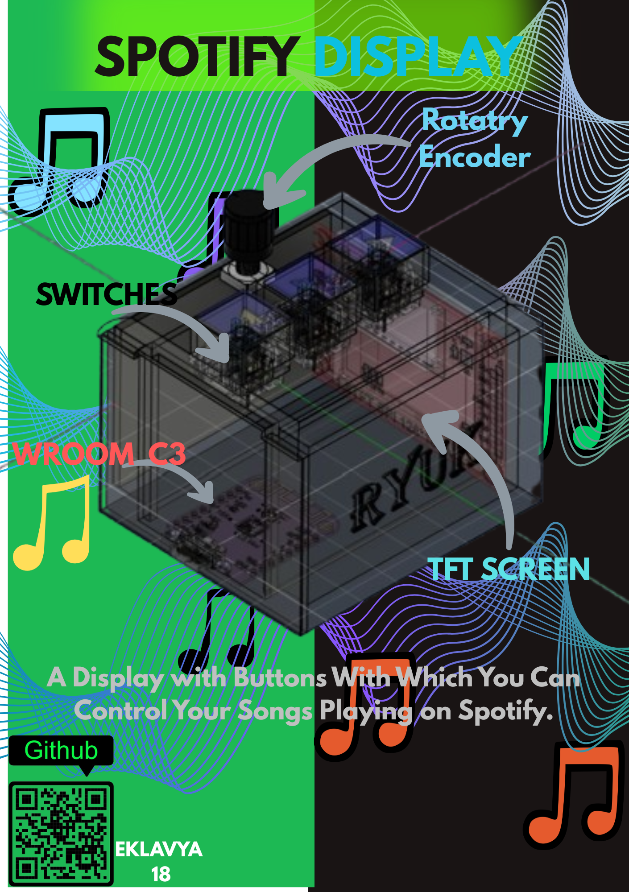

# Spotify Display
This is a Spotify Display Project with which you can control your spotify. You can Play/Pause, forward and Backward the songs. I will add more features in future like managing playlists and shuffling playlists.

## Why
I created this Project to control my Songs playing on Spotify without touching my Phone. This Become easier and feels better to control Songs with a separate display with Physical Buttons. This Project helped me learn how to use Spotify API.

## Zine

## BOM(Bill Of Materials)
|Name| Quantity| Total Cost (USD) | Link | Distributor|
|----|---------|------------------|------|------------|
| Esp32 C3 Mini | 1 | $2.5 | [Link](https://robu.in/product/esp32-c3-development-board-with-soldering/?gad_source=1&gad_campaignid=21296336107&gclid=CjwKCAjw3ejRBhAdEiwADkqPny-qgi54L9slNDuyxyBi9_V4dJO201Za-CnGg5tMcDLZ9UxwxrNwXBoC-5kQAvD_BwE) | Robu |
| TFT Display | 1 | $6.7 | [Link](https://robu.in/product/2-4-inch-spi-interface-240x320-touch-screen-tft-display-module/) | Robu |
| Push Buttons | 10 | $0.15 | [Link](https://robu.in/product/6x6x5-tactile-push-button-switch/) | Robu |
| Rotatry Encoder | 1 | $0.6 | [Link](https://robu.in/product/green-rotary-encoder-module-for-arduino-without-demo-code/) | Robu |